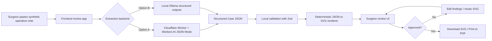
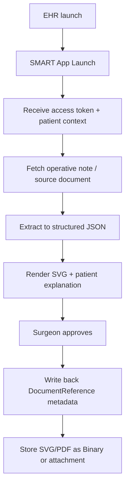
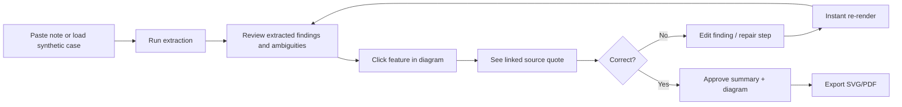

# Low-Cost Implementation Guide for a Surgeon-Reviewed Patient-Facing Surgical Diagram Generator

## Executive summary

A proof of concept for a **surgeon-reviewed, patient-facing surgical-diagram generator from operative notes** is technically feasible today at very low cost **if you narrow the problem and make the visual output deterministic**. For an initial tympanoplasty/ossiculoplasty product, the right architecture is not “generate an image from scratch,” but rather: **extract a tightly scoped clinical JSON from the note, link each extracted fact back to source text, and render from a controlled SVG anatomy library**. That design is cheaper, easier to validate, safer for unsupported inference, and much more compatible with surgeon review than open-ended image generation. Cloudflare Workers AI supports schema-constrained JSON Mode, while Ollama supports local structured outputs on `localhost`; both are suitable for a synthetic-note proof of concept. Cloudflare’s free platform includes a Workers free tier, a Pages free tier, and Workers AI daily free allocation, while GitHub Actions is free for public repositories and includes limited minutes for private repositories. citeturn17view0turn18view0turn19view0turn19view1turn19view2turn26view0turn26view1turn26view2

The best low-cost implementation path is a **static web app on Cloudflare Pages** for the UI plus either **a dedicated Cloudflare Worker API** for extraction or **local Ollama** for fully local inference. Cloudflare’s current guidance is to use Workers for full-stack Next.js apps, but for a cost-minimized prototype you can keep the frontend mostly static and put only the extraction API in a Worker. That preserves Pages’ free unlimited static bandwidth while keeping dynamic usage small. citeturn27view0turn19view1turn19view0

For a proof of concept, you should use **synthetic notes only**. If you later process real operative notes, HIPAA changes the architecture: HHS says a cloud service provider that creates, receives, maintains, or transmits ePHI is a business associate and requires a HIPAA-compliant BAA, and this remains true even if the CSP stores only encrypted ePHI without the key. Cloudflare states its BAA is available only for Enterprise-level customers with minimum spending thresholds. That means the free/self-serve stack is appropriate for **synthetic data prototyping**, but not for production PHI. citeturn24view0turn24view1turn24view3

From a regulatory perspective, a product positioned as a **surgeon-approved educational explanation of what was done**, without diagnosis, treatment recommendation, or autonomous clinical decision-making, is much more likely to fit FDA’s examples of software functions that are **not medical devices** or are otherwise not the focus of oversight. FDA explicitly lists general patient education software and interactive anatomy diagrams as examples not regulated as devices, while also emphasizing that software intended to drive clinical assessment or diagnosis can change the regulatory posture. citeturn23view0turn23view1

The recommended product strategy is therefore:

1. **Scope narrowly** to tympanoplasty/ossiculoplasty variants with a controlled vocabulary.
2. **Use only synthetic notes** in v0.
3. **Require surgeon review and approval before export**.
4. **Render from deterministic SVG components**, not generative images.
5. **Persist evidence links** from each visual feature back to note text.
6. **Plan for later SMART-on-FHIR integration** using launch context plus `DocumentReference`/`Binary` write-back, but do not block the POC on EHR integration. SMART App Launch supports provider and patient launch contexts, including `launch/patient`, and FHIR `DocumentReference` and `Binary` are designed to index and store documents and native binary artifacts such as images and PDFs. citeturn20view0turn20view1turn21view0turn22view0

## Assumptions and target product definition

The following assumptions are explicit because they were unspecified.

| Area | Assumption for this guide | Why this is reasonable for v0 |
|---|---|---|
| Data | **Synthetic operative notes only** | Avoids PHI, BAA, de-identification workflow, and IRB-style questions in the prototype. |
| Clinical scope | **Otology only**, starting with **tympanoplasty/ossiculoplasty** | Narrow ontology makes extraction and rendering tractable. |
| Review workflow | **A surgeon or fellow approves every output before sharing** | Keeps the tool educational and human-supervised. |
| EHR | **Target hospital EHR unspecified** | Therefore build standalone first; treat SMART-on-FHIR as a later adapter layer. |
| Users | One surgeon reviewer, optional trainee/editor, patient-family viewer | Minimizes RBAC complexity in v0. |
| Output format | **SVG primary**, optional browser-print PDF | SVG is deterministic, inspectable, cheap, and easy to diff/test. |
| Hosting | Zero-cost or free-tier first | Matches the required implementation goal. |
| Authentication | Minimal for synthetic demo; stronger auth added only if external sharing begins | Reduces early friction. |
| Languages | English only | Simplifies clinical lexicon and UX copy. |
| Regulatory intent | Educational visualization of documented procedure, not diagnosis/recommendation | Helps keep scope out of higher-risk software functions. |

### Product definition

The recommended v0 product is a **surgeon-facing review tool that produces a patient-friendly surgical diagram and explanation panel from an operative note**. The surgeon pastes or loads a note, the model extracts a structured case object, the app renders a deterministic otology SVG, and the surgeon edits/approves before export.

The visual system should be constrained to a **small, explicit surgical ontology**, for example:

- laterality: left, right, bilateral
- tympanic membrane status: perforation present, size bucket, quadrant
- ossicular findings: incus erosion, stapes intact/mobile, malleus status
- graft/reconstruction: fascia, cartilage, bone cement, PORP, TORP
- approach/context: postauricular, transcanal, microscope/endoscope
- reconstruction actions: underlay graft, joint repaired, prosthesis placed, cement application

For a first tympanoplasty/ossiculoplasty release, the renderer should support only findings and repairs that are commonly and clearly documented in notes. Unsupported concepts should be surfaced as **“not rendered”** rather than guessed. That design is directly aligned with HHS de-identification guidance’s warning that free-text clinical narratives are information-rich and that removal of identifiers alone is not enough if the publisher has actual knowledge that remaining context could re-identify someone; the same principle applies here to clinical fidelity: rich text should not be over-interpreted. citeturn29view0turn29view2

### Design principles

The product should be built around six principles.

First, **evidence-linked extraction**. Every rendered feature should carry a source quote and recovered offsets.

Second, **no unsupported inference**. If the note does not say “cartilage graft,” the diagram should not show cartilage because it is common.

Third, **deterministic rendering over image synthesis**. Image models are harder to validate and nearly impossible to diff reliably in CI.

Fourth, **surgeon review is part of the product, not a fallback**. The tool is meant to reduce explanation friction, not replace operative judgment.

Fifth, **patient-facing simplification happens after structured extraction**, not before. Separate the clinical object from the patient explanation text.

Sixth, **free-tier-friendly architecture**. Pages for static UI, Worker or local Ollama for extraction, no mandatory database in v0. Cloudflare Pages’ free tier includes 500 builds per month, unlimited static requests, and unlimited bandwidth; Workers free includes 100,000 requests per day; Workers AI includes 10,000 neurons per day free; and GitHub Actions is free on public repos and includes a monthly allowance for private repos. citeturn19view1turn19view0turn18view0turn19view2

## Architecture and data contracts

### Recommended reference architecture

The lowest-risk architecture for v0 is a **split system**:

- **Frontend**: static Next.js or React app on Cloudflare Pages
- **Extraction API**: Cloudflare Worker using Workers AI JSON Mode, or a local-only Ollama adapter
- **Renderer**: pure TypeScript in the browser or Worker, mapping JSON to SVG
- **Storage**: none required initially; optional KV or D1 only for saved synthetic cases, template versions, or audit events
- **Export**: client-side SVG download and browser-print PDF
- **Review control**: surgeon approval gate before sharing/export

Cloudflare recommends Workers for full-stack Next.js rather than static Pages when you need dynamic app behavior. For the absolute cheapest prototype, though, a static frontend with a separate Worker API is still simpler and keeps the largest traffic component on Pages’ free unlimited static serving. If you want a single deployable app later, the Cloudflare Workers Next.js guide supports App Router, Route Handlers, SSR, ISR, Server Actions, and middleware via the OpenNext adapter. citeturn27view0turn19view3



### Backend comparison

The backend comparison below uses official pricing and capability docs for Cloudflare, Ollama, and GitHub.

| Option | Best use in this product | Free / low-cost posture | Structured outputs | Strengths | Weaknesses | Recommendation |
|---|---|---|---|---|---|---|
| Cloudflare Worker + Workers AI | Hosted extraction API for synthetic-note POC | Worker free tier + Workers AI daily free neurons | Yes, via JSON Mode | Hosted, no local setup for reviewers, easy deploy, good for demo links | JSON Mode can fail, no streaming in JSON Mode, not PHI-ready on free/self-serve | **Best hosted POC** |
| Local Ollama | Fully local extraction on your machine | No API spend; local runtime | Yes, local structured outputs | Zero marginal API cost, local data path, ideal for dev and review | Requires local machine/runtime, localhost API has no auth by default, not easy for remote reviewers | **Best no-cloud POC** |
| Static-only app with hand-authored mock JSON | Renderer and UX development before extraction | Essentially free | N/A | Fastest way to build diagram engine and review workflow | No NLP; not useful for end-to-end validation | **Do this in week one** |

Cloudflare Workers AI supports JSON Mode using `response_format` with `json_schema`, explicitly lists supported models, warns that schema compliance is not guaranteed, returns `JSON Mode couldn't be met` in failure cases, and does not support streaming in JSON Mode. Ollama supports structured outputs locally by passing `format` as JSON or a JSON Schema, but its cloud offering currently does not support structured outputs; the local API is served by default at `http://localhost:11434/api` and requires no authentication for local access. citeturn17view0turn26view0turn26view1turn26view2

### Hosting and deployment comparison

| Hosting pattern | When to use it | Cost profile | Notes |
|---|---|---|---|
| Cloudflare Pages static frontend + separate Worker API | Cheapest hosted POC | Very low; static serving on Pages free, API on Workers free until limits | Best balance of simplicity and hosted demo capability |
| Full-stack Next.js on Cloudflare Workers | When you want one deploy target and richer server behavior | Low, but slightly more moving parts | Cloudflare’s preferred path for dynamic Next.js |
| Local-only frontend + local Ollama | Solo builder / surgeon desktop demo | Near-zero cash cost | Best privacy posture for non-shared prototype |
| Git-integrated Pages deployment | Fast CI/CD with previews | Free-tier-friendly | Preview URLs and PR status checks are built in |

Cloudflare Pages supports GitHub/GitLab integration with automatic deploys, preview URLs for branches and pull requests, and repository status checks. Pages’ free tier includes 500 builds per month and unlimited static requests/bandwidth. Workers free includes 100,000 requests per day and Workers Logs on free includes 200,000 log events per day with 3-day retention. GitHub Actions is free on public repos, while GitHub Free private repos include 2,000 minutes/month and 500 MB artifact storage. citeturn30view0turn19view1turn19view0turn19view2

### Architecture for future EHR integration

Do **not** make EHR integration a prerequisite for the proof of concept. But the right later path is clear:



SMART App Launch supports applications launched from inside or outside the EHR and supports launch context negotiation such as `launch/patient`. The token response can include patient context. On the storage side, `DocumentReference` is used to index clinical notes and other binary objects, while `Binary` is used for native content such as images and PDFs and can use `securityContext` as a proxy for access control. That is the cleanest eventual path for write-back of a reviewed SVG or PDF. citeturn20view0turn20view1turn21view0turn22view0

### Source-of-truth schema

The extraction schema should be the product’s source of truth. Start with **Zod in TypeScript**, derive JSON Schema for the LLM request when possible, and reject anything not conforming.

```ts
import { z } from "zod";

const SourceSpan = z.object({
  quote: z.string().min(1),
  start: z.number().int().nonnegative().nullable(),
  end: z.number().int().nonnegative().nullable(),
  confidence: z.number().min(0).max(1),
});

const Laterality = z.enum(["left", "right", "bilateral", "unspecified"]);

const EvidenceBackedValue = <T extends z.ZodTypeAny>(schema: T) =>
  z.object({
    value: schema,
    evidence: z.array(SourceSpan).min(1),
  });

const Finding = z.object({
  id: z.string(),
  structure: z.enum([
    "tympanic_membrane",
    "malleus",
    "incus",
    "stapes",
    "incudostapedial_joint",
    "middle_ear_mucosa",
    "external_auditory_canal",
    "graft",
    "other"
  ]),
  side: Laterality,
  status: z.enum([
    "normal",
    "perforated",
    "eroded",
    "discontinuous",
    "fixed",
    "mobile",
    "inflamed",
    "retracted",
    "scarred",
    "reconstructed",
    "absent",
    "unsupported"
  ]),
  severity: z.enum(["mild", "moderate", "severe", "not_stated"]).default("not_stated"),
  location_detail: z.string().nullable().default(null),
  negated: z.boolean().default(false),
  evidence: z.array(SourceSpan).min(1),
});

const RepairStep = z.object({
  id: z.string(),
  action: z.enum([
    "freshen_perforation_edges",
    "elevate_tympanomeatal_flap",
    "place_underlay_graft",
    "place_overlay_graft",
    "repair_ossicular_erosion_with_cement",
    "place_porp",
    "place_torp",
    "lysis_of_adhesions",
    "other"
  ]),
  target_structure: z.enum([
    "tympanic_membrane",
    "incus",
    "stapes",
    "incudostapedial_joint",
    "middle_ear",
    "other"
  ]),
  material: z.enum([
    "temporalis_fascia",
    "tragal_cartilage",
    "perichondrium",
    "otomimix_bone_cement",
    "porp",
    "torp",
    "none",
    "other",
    "not_stated"
  ]),
  side: Laterality,
  evidence: z.array(SourceSpan).min(1),
});

const Ambiguity = z.object({
  field: z.string(),
  reason: z.enum([
    "not_documented",
    "contradictory_note",
    "unsupported_concept",
    "unclear_laterality",
    "unclear_material",
    "unclear_structure"
  ]),
  evidence: z.array(SourceSpan).default([]),
});

export const OperativeDiagramCase = z.object({
  schema_version: z.literal("1.0.0"),
  case_id: z.string(),
  procedure_family: z.enum(["tympanoplasty", "ossiculoplasty", "combined"]),
  laterality: Laterality,
  procedure_name_raw: z.string(),
  findings: z.array(Finding),
  repair_steps: z.array(RepairStep),
  patient_facing_summary: z.object({
    title: z.string(),
    explanation: z.string(),
    uncertainty_note: z.string().nullable().default(null),
  }),
  rendering_hints: z.object({
    template_id: z.enum([
      "oto.tympanoplasty.basic.v1",
      "oto.tympanoplasty.ossiculoplasty.v1"
    ]),
    show_labels: z.boolean().default(true),
    show_legend: z.boolean().default(true),
    emphasis_targets: z.array(z.string()).default([]),
  }),
  ambiguities: z.array(Ambiguity).default([]),
  approval: z.object({
    status: z.enum(["draft", "surgeon_edited", "surgeon_approved"]),
    approved_by: z.string().nullable().default(null),
    approved_at: z.string().datetime().nullable().default(null),
  }),
});
```

### JSON API contracts

Use three core contracts.

```json
POST /api/extract
{
  "note_text": "string",
  "schema_version": "1.0.0",
  "procedure_scope": ["tympanoplasty", "ossiculoplasty"],
  "mode": "cloudflare-ai"
}
```

```json
200 /api/extract
{
  "ok": true,
  "case": {
    "schema_version": "1.0.0",
    "case_id": "syn-001",
    "procedure_family": "combined",
    "laterality": "left",
    "procedure_name_raw": "Left tympanoplasty with ossiculoplasty",
    "findings": [],
    "repair_steps": [],
    "patient_facing_summary": {
      "title": "Your left eardrum and hearing bones were repaired",
      "explanation": "The surgeon repaired a hole in the eardrum and strengthened part of the small hearing-bone connection.",
      "uncertainty_note": null
    },
    "rendering_hints": {
      "template_id": "oto.tympanoplasty.ossiculoplasty.v1",
      "show_labels": true,
      "show_legend": true,
      "emphasis_targets": ["incudostapedial_joint"]
    },
    "ambiguities": [],
    "approval": {
      "status": "draft",
      "approved_by": null,
      "approved_at": null
    }
  },
  "warnings": []
}
```

```json
POST /api/render
{
  "case": { "...OperativeDiagramCase..." },
  "theme": "default"
}
```

```json
200 /api/render
{
  "ok": true,
  "svg": "<svg ...>...</svg>",
  "render_meta": {
    "template_id": "oto.tympanoplasty.ossiculoplasty.v1",
    "feature_ids": [
      "tm-perforation-left-posterior",
      "incus-long-process-eroded",
      "is-joint-cement-repair"
    ]
  }
}
```

```json
POST /api/approve
{
  "case_id": "syn-001",
  "editor_email": "surgeon@example.org",
  "edits": {
    "findings": [],
    "repair_steps": [],
    "patient_facing_summary": {
      "title": "Updated title"
    }
  }
}
```

### JSON Schema for LLM extraction

For Cloudflare Workers AI, pass JSON Schema via `response_format`. For Ollama, pass the same schema via `format`. Both platforms document that pattern. citeturn17view0turn26view0

A practical extraction schema fragment:

```json
{
  "type": "object",
  "additionalProperties": false,
  "required": [
    "schema_version",
    "case_id",
    "procedure_family",
    "laterality",
    "procedure_name_raw",
    "findings",
    "repair_steps",
    "patient_facing_summary",
    "rendering_hints",
    "ambiguities",
    "approval"
  ],
  "properties": {
    "schema_version": { "const": "1.0.0" },
    "case_id": { "type": "string" },
    "procedure_family": {
      "type": "string",
      "enum": ["tympanoplasty", "ossiculoplasty", "combined"]
    },
    "laterality": {
      "type": "string",
      "enum": ["left", "right", "bilateral", "unspecified"]
    },
    "procedure_name_raw": { "type": "string" },
    "findings": {
      "type": "array",
      "items": {
        "type": "object",
        "additionalProperties": false,
        "required": ["id", "structure", "side", "status", "severity", "negated", "evidence"],
        "properties": {
          "id": { "type": "string" },
          "structure": {
            "type": "string",
            "enum": [
              "tympanic_membrane",
              "malleus",
              "incus",
              "stapes",
              "incudostapedial_joint",
              "middle_ear_mucosa",
              "external_auditory_canal",
              "graft",
              "other"
            ]
          },
          "side": { "type": "string", "enum": ["left", "right", "bilateral", "unspecified"] },
          "status": {
            "type": "string",
            "enum": ["normal", "perforated", "eroded", "discontinuous", "fixed", "mobile", "inflamed", "retracted", "scarred", "reconstructed", "absent", "unsupported"]
          },
          "severity": { "type": "string", "enum": ["mild", "moderate", "severe", "not_stated"] },
          "location_detail": { "type": ["string", "null"] },
          "negated": { "type": "boolean" },
          "evidence": {
            "type": "array",
            "minItems": 1,
            "items": {
              "type": "object",
              "additionalProperties": false,
              "required": ["quote", "start", "end", "confidence"],
              "properties": {
                "quote": { "type": "string" },
                "start": { "type": ["integer", "null"] },
                "end": { "type": ["integer", "null"] },
                "confidence": { "type": "number", "minimum": 0, "maximum": 1 }
              }
            }
          }
        }
      }
    }
  }
}
```

### System prompt and few-shot extraction prompt

Use a system prompt that makes the model behave like a **strict evidence extractor**, not a summarizer.

```text
SYSTEM PROMPT

You extract ONLY surgeon-documented facts from operative notes for a patient-facing educational diagram.

Rules:
- Return valid JSON matching the provided schema exactly.
- Never infer undocumented anatomy, laterality, graft material, device type, or repair steps.
- If a fact is negated, keep it negated and do not render it as present.
- If a concept is mentioned but unsupported by the schema, add an ambiguity with reason "unsupported_concept".
- Every finding and repair_step must include at least one evidence item with an exact quote copied from the note.
- If start/end offsets are uncertain, set them to null; do not guess character positions.
- Patient-facing summary must be plain-language, brief, and faithful to the extracted facts.
- If the note is contradictory, preserve the conflict in ambiguities and do not resolve it yourself.
- If laterality is missing or inconsistent, use "unspecified".
- This is an educational artifact, not a diagnosis or treatment recommendation.
```

A few-shot pair emphasizing negation:

```text
USER
Extract from this note:
"Right tympanoplasty performed. Stapes superstructure intact and mobile. No prosthesis was placed. The long process of the incus was eroded and repaired with Otomimix bone cement."

ASSISTANT
{
  "schema_version": "1.0.0",
  "case_id": "demo-neg-001",
  "procedure_family": "combined",
  "laterality": "right",
  "procedure_name_raw": "Right tympanoplasty performed",
  "findings": [
    {
      "id": "f1",
      "structure": "stapes",
      "side": "right",
      "status": "mobile",
      "severity": "not_stated",
      "location_detail": null,
      "negated": false,
      "evidence": [{"quote": "Stapes superstructure intact and mobile.", "start": null, "end": null, "confidence": 0.99}]
    },
    {
      "id": "f2",
      "structure": "incus",
      "side": "right",
      "status": "eroded",
      "severity": "not_stated",
      "location_detail": "long process",
      "negated": false,
      "evidence": [{"quote": "The long process of the incus was eroded", "start": null, "end": null, "confidence": 0.99}]
    }
  ],
  "repair_steps": [
    {
      "id": "r1",
      "action": "repair_ossicular_erosion_with_cement",
      "target_structure": "incus",
      "material": "otomimix_bone_cement",
      "side": "right",
      "evidence": [{"quote": "repaired with Otomimix bone cement", "start": null, "end": null, "confidence": 0.99}]
    }
  ],
  "patient_facing_summary": {
    "title": "Your right eardrum surgery included reinforcement of a small hearing-bone connection",
    "explanation": "The surgeon documented wear of part of the incus and repaired that area with bone cement. The stapes was documented as intact and mobile.",
    "uncertainty_note": null
  },
  "rendering_hints": {
    "template_id": "oto.tympanoplasty.ossiculoplasty.v1",
    "show_labels": true,
    "show_legend": true,
    "emphasis_targets": ["incus", "incudostapedial_joint"]
  },
  "ambiguities": [],
  "approval": {
    "status": "draft",
    "approved_by": null,
    "approved_at": null
  }
}
```

A few-shot pair emphasizing ambiguity and unsupported inference:

```text
USER
Extract from this note:
"Cartilage graft tympanoplasty was considered. Final reconstruction performed in standard fashion. Ossicles appeared satisfactory."

ASSISTANT
{
  "schema_version": "1.0.0",
  "case_id": "demo-amb-001",
  "procedure_family": "tympanoplasty",
  "laterality": "unspecified",
  "procedure_name_raw": "Final reconstruction performed in standard fashion",
  "findings": [],
  "repair_steps": [],
  "patient_facing_summary": {
    "title": "The note does not document enough detail for a specific surgical diagram",
    "explanation": "The note suggests a standard reconstruction but does not clearly document the exact laterality, graft used, or specific reconstructed structures.",
    "uncertainty_note": "Some details were mentioned as possibilities rather than confirmed final steps."
  },
  "rendering_hints": {
    "template_id": "oto.tympanoplasty.basic.v1",
    "show_labels": true,
    "show_legend": true,
    "emphasis_targets": []
  },
  "ambiguities": [
    {
      "field": "laterality",
      "reason": "unclear_laterality",
      "evidence": []
    },
    {
      "field": "repair_steps.material",
      "reason": "unclear_material",
      "evidence": [{"quote": "Cartilage graft tympanoplasty was considered.", "start": null, "end": null, "confidence": 0.98}]
    }
  ],
  "approval": {
    "status": "draft",
    "approved_by": null,
    "approved_at": null
  }
}
```

### Cloudflare Worker extraction route

Cloudflare Workers AI JSON Mode is an excellent fit for v0 because it natively accepts a schema-constrained response format. Cloudflare documents JSON Mode support and publishes supported models and per-model pricing. citeturn17view0turn18view0

```ts
// worker/src/index.ts
export interface Env {
  AI: Ai;
}

const extractionSchema = {
  type: "object",
  // trimmed for brevity; use the full JSON Schema from your source-of-truth
  properties: {
    schema_version: { const: "1.0.0" },
    case_id: { type: "string" },
    procedure_family: { type: "string", enum: ["tympanoplasty", "ossiculoplasty", "combined"] },
    laterality: { type: "string", enum: ["left", "right", "bilateral", "unspecified"] },
    findings: { type: "array" },
    repair_steps: { type: "array" },
    patient_facing_summary: { type: "object" },
    rendering_hints: { type: "object" },
    ambiguities: { type: "array" },
    approval: { type: "object" },
    procedure_name_raw: { type: "string" }
  },
  required: [
    "schema_version",
    "case_id",
    "procedure_family",
    "laterality",
    "procedure_name_raw",
    "findings",
    "repair_steps",
    "patient_facing_summary",
    "rendering_hints",
    "ambiguities",
    "approval"
  ],
  additionalProperties: false
};

export default {
  async fetch(request: Request, env: Env): Promise<Response> {
    if (request.method !== "POST") {
      return new Response("Method not allowed", { status: 405 });
    }

    const body = await request.json<{ note_text: string }>().catch(() => null);
    if (!body?.note_text?.trim()) {
      return Response.json({ ok: false, error: "Missing note_text" }, { status: 400 });
    }

    const messages = [
      {
        role: "system",
        content:
          "You extract only directly supported operative-note facts for a patient-facing ENT surgical diagram. Never infer undocumented facts. Return valid JSON exactly matching the schema."
      },
      {
        role: "user",
        content: body.note_text
      }
    ];

    try {
      const result = await env.AI.run("@cf/meta/llama-3.1-8b-instruct-fast", {
        messages,
        response_format: {
          type: "json_schema",
          json_schema: extractionSchema
        }
      });

      return Response.json({ ok: true, case: result.response });
    } catch (err) {
      return Response.json(
        {
          ok: false,
          error: "Extraction failed",
          detail: String(err)
        },
        { status: 502 }
      );
    }
  }
};
```

### Local Ollama adapter

Ollama documents structured outputs and shows using either `"format": "json"` or a JSON Schema object in `format`, with the local API served by default at `http://localhost:11434/api`. citeturn26view0turn26view1

```ts
// app/lib/extractWithOllama.ts
export async function extractWithOllama(noteText: string, schema: object) {
  const res = await fetch("http://localhost:11434/api/chat", {
    method: "POST",
    headers: { "Content-Type": "application/json" },
    body: JSON.stringify({
      model: "gpt-oss",
      stream: false,
      format: schema,
      messages: [
        {
          role: "system",
          content:
            "Extract only directly supported tympanoplasty/ossiculoplasty facts. No unsupported inference."
        },
        { role: "user", content: noteText }
      ]
    })
  });

  if (!res.ok) {
    throw new Error(`Ollama request failed: ${res.status}`);
  }

  const json = await res.json();
  return JSON.parse(json.message.content);
}
```

## Rendering system and clinician UX

### SVG component design conventions

The rendering system should be built as a **versioned otology SVG kit**, not a one-off illustration.

Use these conventions.

| Convention | Rule |
|---|---|
| Viewbox | All templates use `viewBox="0 0 1200 800"` |
| Coordinate system | Left/right ear templates are mirrored variants, not runtime transforms |
| IDs | `oto.<template>.<layer>.<feature>` |
| Groups | Every clinically meaningful part is a `<g>` with `id`, `data-structure`, `data-side`, `data-state` |
| Layer order | `background` → `anatomy_base` → `pathology` → `repair` → `callouts` → `labels` → `interaction` |
| Hit targets | Separate invisible `<path>` or `<rect>` in `interaction` layer for click/hover |
| Styling | Geometry classes, not inline styles, except deliberate overrides |
| Versioning | Asset folder names pinned by semantic version, e.g. `assets/svg/oto/1.0.0/` |
| Feature flags | Missing feature = hidden whole group, not partial mutation |
| Text | Patient-facing labels outside anatomy layer to keep geometry reusable |

Name layers and groups predictably:

- `oto.tympanoplasty.ossiculoplasty_v1.anatomy_base.tm`
- `oto.tympanoplasty.ossiculoplasty_v1.pathology.incus_long_process_erosion`
- `oto.tympanoplasty.ossiculoplasty_v1.repair.is_joint_cement_bridge`
- `oto.tympanoplasty.ossiculoplasty_v1.callouts.feature_f2`
- `oto.tympanoplasty.ossiculoplasty_v1.interaction.feature_f2_hit`

A minimal SVG fragment:

```svg
<svg viewBox="0 0 1200 800" xmlns="http://www.w3.org/2000/svg" role="img" aria-labelledby="title desc">
  <title id="title">Left tympanoplasty with ossicular repair</title>
  <desc id="desc">Educational diagram of a left eardrum repair and ossicular cement reconstruction.</desc>

  <g id="oto.tympanoplasty.ossiculoplasty_v1.anatomy_base">
    <g id="oto.tympanoplasty.ossiculoplasty_v1.anatomy_base.tm" data-structure="tympanic_membrane" data-side="left" data-state="baseline">
      <path d="M240,180 C390,150 510,260 500,410 C490,560 330,620 220,510 C130,420 120,240 240,180 Z" class="tm-base"/>
    </g>
    <g id="oto.tympanoplasty.ossiculoplasty_v1.anatomy_base.incus" data-structure="incus" data-side="left" data-state="baseline">
      <path d="M650,240 L710,330 L690,430" class="ossicle-base"/>
    </g>
    <g id="oto.tympanoplasty.ossiculoplasty_v1.anatomy_base.stapes" data-structure="stapes" data-side="left" data-state="baseline">
      <path d="M740,430 L770,470 L710,470 Z" class="ossicle-base"/>
    </g>
  </g>

  <g id="oto.tympanoplasty.ossiculoplasty_v1.pathology">
    <path id="oto.tympanoplasty.ossiculoplasty_v1.pathology.incus_long_process_erosion"
          data-structure="incus"
          data-feature-id="f2"
          d="M688,392 L694,418"
          class="erosion-highlight"/>
  </g>

  <g id="oto.tympanoplasty.ossiculoplasty_v1.repair">
    <path id="oto.tympanoplasty.ossiculoplasty_v1.repair.is_joint_cement_bridge"
          data-material="otomimix_bone_cement"
          data-feature-id="r1"
          d="M692,418 Q715,430 737,437"
          class="cement-bridge"/>
  </g>
</svg>
```

### Deterministic JSON-to-SVG algorithm

The renderer should be pure and testable.

```ts
type RenderOutput = {
  svg: string;
  featureMap: Array<{
    featureId: string;
    svgIds: string[];
    evidenceQuotes: string[];
  }>;
};

export function renderOtologyCase(input: OperativeDiagramCase): RenderOutput {
  validateCase(input);

  const template = loadTemplate(input.rendering_hints.template_id);
  const dom = cloneSvgTemplate(template);
  const featureMap: RenderOutput["featureMap"] = [];

  setText(dom, "title", input.patient_facing_summary.title);
  setLegendVisibility(dom, input.rendering_hints.show_legend);
  setLabelVisibility(dom, input.rendering_hints.show_labels);

  // Start hidden for all optional layers
  hideAllOptionalGroups(dom);

  // Findings
  for (const finding of input.findings) {
    if (finding.negated) continue;

    const ids = applyFinding(dom, finding); // deterministic mapping table
    featureMap.push({
      featureId: finding.id,
      svgIds: ids,
      evidenceQuotes: finding.evidence.map((e) => e.quote),
    });
  }

  // Repairs
  for (const step of input.repair_steps) {
    const ids = applyRepairStep(dom, step); // deterministic mapping table
    featureMap.push({
      featureId: step.id,
      svgIds: ids,
      evidenceQuotes: step.evidence.map((e) => e.quote),
    });
  }

  // Ambiguity banner
  if (input.ambiguities.length > 0) {
    enable(dom, "ui.ambiguity_banner");
    setText(dom, "ui.ambiguity_banner_text", buildAmbiguityText(input.ambiguities));
  }

  // Emphasis
  for (const target of input.rendering_hints.emphasis_targets) {
    emphasizeTarget(dom, target);
  }

  attachInteractiveMetadata(dom, featureMap);
  const svg = serialize(dom);

  return { svg, featureMap };
}
```

The mapping itself should live in a simple table, not hidden in drawing code:

```ts
const FINDING_MAP = {
  "incus|eroded|left": ["pathology.incus_long_process_erosion"],
  "incudostapedial_joint|discontinuous|left": ["pathology.is_joint_gap"],
  "tympanic_membrane|perforated|left": ["pathology.tm_perforation_left"]
} as const;

const REPAIR_MAP = {
  "repair_ossicular_erosion_with_cement|incus|otomimix_bone_cement|left": ["repair.is_joint_cement_bridge"],
  "place_underlay_graft|tympanic_membrane|temporalis_fascia|left": ["repair.tm_underlay_fascia"]
} as const;
```

This algorithm is intentionally boring. That is a feature. It lets you hash SVG output in tests, diff changes in PRs, and explain precisely why a visual element appeared.

### UI wireframes and interaction flow

The primary screen should be a **two-column review workspace**.

```text
┌──────────────────────────────────────────────────────────────────────────────┐
│ Header: Case ID | Template | Backend mode | Save draft | Export SVG/PDF    │
├───────────────────────────────┬──────────────────────────────────────────────┤
│ Left panel                    │ Right panel                                  │
│ Operative note                │ Diagram preview                              │
│ ┌───────────────────────────┐ │ ┌──────────────────────────────────────────┐ │
│ │ pasted synthetic note     │ │ │ rendered SVG                            │ │
│ │ with highlighted spans    │ │ │ hover selects feature + evidence        │ │
│ └───────────────────────────┘ │ └──────────────────────────────────────────┘ │
│                               │                                              │
│ Extracted facts               │ Patient-facing explanation                   │
│ ┌───────────────────────────┐ │ ┌──────────────────────────────────────────┐ │
│ │ findings table            │ │ │ editable title + explanation            │ │
│ │ repair steps table        │ │ └──────────────────────────────────────────┘ │
│ │ ambiguities table         │ │                                              │
│ └───────────────────────────┘ │ Evidence inspector                           │
│                               │ ┌──────────────────────────────────────────┐ │
│                               │ │ selected feature → source quote(s)      │ │
│                               │ └──────────────────────────────────────────┘ │
├───────────────────────────────┴──────────────────────────────────────────────┤
│ Footer actions: Re-run extraction | Mark unsupported | Approve | Export      │
└──────────────────────────────────────────────────────────────────────────────┘
```

The surgeon workflow should be:



### Interaction rules

The UX should enforce a few non-negotiable rules.

Every extracted row in the findings/repair tables must have:

- a structured value
- at least one evidence quote
- a support badge: `supported`, `ambiguous`, or `unsupported`

Every diagram feature should be clickable and open the linked quotes in the note.

Every user edit should be typed—dropdown or enum when possible—not freeform text unless absolutely necessary.

Every export should show whether the diagram is **draft** or **surgeon approved**.

If a feature lacks evidence, the UI should not permit approval.

### Next.js review component example

```tsx
"use client";

import { useMemo, useState } from "react";

type FeatureMapItem = {
  featureId: string;
  svgIds: string[];
  evidenceQuotes: string[];
};

export function ReviewPanel({
  svg,
  featureMap,
}: {
  svg: string;
  featureMap: FeatureMapItem[];
}) {
  const [selectedFeatureId, setSelectedFeatureId] = useState<string | null>(null);

  const selected = useMemo(
    () => featureMap.find((f) => f.featureId === selectedFeatureId) ?? null,
    [featureMap, selectedFeatureId]
  );

  return (
    <div className="grid grid-cols-2 gap-4">
      <div
        className="rounded border p-4"
        dangerouslySetInnerHTML={{ __html: svg }}
        onClick={(e) => {
          const target = e.target as HTMLElement;
          const id = target.getAttribute("data-feature-id");
          if (id) setSelectedFeatureId(id);
        }}
      />
      <div className="rounded border p-4">
        <h3 className="font-semibold">Evidence</h3>
        {selected ? (
          <ul className="mt-2 space-y-2">
            {selected.evidenceQuotes.map((q, i) => (
              <li key={i} className="rounded bg-neutral-50 p-2 text-sm">
                {q}
              </li>
            ))}
          </ul>
        ) : (
          <p className="text-sm text-neutral-500">
            Select a diagram feature to inspect source text.
          </p>
        )}
      </div>
    </div>
  );
}
```

## Validation, testing, and evaluation

### Validation stack

Use four validation layers in sequence.

**Schema validation** rejects malformed JSON.

**Ontology validation** rejects impossible combinations, such as `material=otomimix_bone_cement` on `place_torp`.

**Evidence validation** requires at least one source quote per rendered feature and verifies quote occurrence in the note when offsets are null.

**Render validation** ensures every rendered optional SVG group corresponds to an extracted finding or step and vice versa.

This is where deterministic SVG wins. Because the Renderer is a pure function, you can snapshot-test the exact SVG and feature map.

### Unit and integration test suite

The most important test cases are below.

| Test name | Input pattern | Expected behavior |
|---|---|---|
| Basic laterality | “Left tympanoplasty…” | Extract `left`; left template renders |
| Negation prosthesis | “No prosthesis was placed” | No PORP/TORP rendered |
| Incus erosion + cement | “Incus long process eroded… repaired with Otomimix bone cement” | Erosion overlay + cement repair overlay |
| Ambiguous material | “Cartilage graft was considered” | Material ambiguity; no cartilage rendered unless final step documented |
| Contradictory laterality | “Left ear…” and later “right middle ear” | `laterality=unspecified` or ambiguity raised; approval blocked until edit |
| Unsupported concept | Rare maneuver outside schema | Add ambiguity `unsupported_concept`; no hallucinated visual |
| Normal finding | “Stapes intact and mobile” | Optional normal badge in fact table; no pathology overlay |
| Missing evidence guard | Model returns finding with empty evidence | Zod/validation rejects response |
| Span recovery | Evidence quote appears twice | Recover first exact match plus mark ambiguous if needed |
| Render completeness | All extracted repair steps have matching SVG IDs | Pass if one-to-one or one-to-many mapping defined |
| Deterministic output | Same JSON twice | Same SVG byte-for-byte after normalization |
| Surgeon edit round-trip | Manual edit from `incus` to `incudostapedial_joint` | Re-render only mapped features; audit entry created |
| Export gating | Draft case | Export watermarked “Draft” or disable final export |
| Unsupported inference check | Note omits graft type entirely | `material=not_stated`; no graft-specific art |
| Note with only summary language | “Reconstruction performed in standard fashion” | High ambiguity state; low-detail template only |

### Negation and unsupported-inference assertions

These three assertions are especially important:

1. **No visual element may appear if the only support is clinical typicality**.
2. **Negated elements must remain visually absent** even if their positive counterpart is clinically common.
3. **Ambiguous note text must degrade to lower-detail diagrams**, not to invented detail.

Cloudflare explicitly notes that JSON Mode may fail or not satisfy the request in extreme situations, so your test harness should include model-failure cases and route them into a deterministic fallback path such as “extraction failed, please review manually.” citeturn17view0

### Evaluation protocol for clinical validation

For clinical validation, separate **extraction accuracy**, **diagram fidelity**, and **workflow usefulness**.

| Dimension | Metric | Target for go/no-go |
|---|---|---|
| Extraction | Field-level precision / recall / F1 on gold JSON | Critical fields F1 ≥ 0.95 |
| Unsupported inference | False-positive rendered facts not in gold | **0 tolerated** on critical fields |
| Evidence integrity | % rendered features with valid supporting quote | 100% |
| Diagram fidelity | Surgeon binary correctness rating | ≥ 90% “acceptable after minor/no edits” |
| Edit burden | Median surgeon edit time per case | ≤ 2 minutes |
| Approval rate | % cases approved after one pass | ≥ 80% for narrow v0 scope |
| Determinism | Repeat-render hash stability | 100% |
| UX | Median time from note paste to approved export | ≤ 3 minutes |
| Safety | % cases with unresolved ambiguity exported as approved | 0% |

A good validation protocol is:

- Build a **gold set of 50–100 synthetic notes** covering common and adversarial patterns.
- Have one otologist create **gold JSON** and **gold rendered expectations**.
- Run blind extraction and rendering.
- Measure field-level disagreement, then surgeon correction time.
- Track failure reasons: negation miss, laterality conflict, unsupported terminology, repair-material confusion, prosthesis confusion.

### Sample synthetic operative notes with gold JSON and gold SVG expectations

The table below is intentionally compact; in the repo, store these as separate fixture files.

| Synthetic note | Gold JSON highlights | Gold SVG output |
|---|---|---|
| “Left tympanoplasty with ossiculoplasty performed. Posterior tympanic membrane perforation identified. Long process of the incus was eroded at the incudostapedial joint. Stapes superstructure intact and mobile. Erosion repaired with Otomimix bone cement. Underlay temporalis fascia graft placed.” | `laterality=left`; findings: `tm perforated`, `incus eroded`, `stapes mobile`; repairs: `cement repair incus`, `underlay graft temporalis_fascia`; ambiguity: none | Render left-ear template; show posterior TM perforation overlay, incus erosion mark, cement bridge, fascia underlay patch, labels and legend |
| “Right endoscopic tympanoplasty. Central perforation refreshed. No prosthesis was placed. Ossicles otherwise intact. Cartilage graft tympanoplasty had been considered preoperatively but final graft was temporalis fascia.” | `laterality=right`; findings: `tm perforated`; repairs: `freshen_perforation_edges`, `place_underlay_graft temporalis_fascia`; no prosthesis rendered; cartilage not rendered | Right-ear template; central perforation + fascia graft; no prosthesis layers |
| “Tympanoplasty completed in standard fashion. Hearing bones looked satisfactory.” | `laterality=unspecified`; findings maybe none; repair_steps none; ambiguities: unclear laterality, unsupported low-detail final reconstruction | Low-detail neutral template or no anatomy-specific diagram; visible uncertainty banner |

An exact gold JSON instance for the first note:

```json
{
  "schema_version": "1.0.0",
  "case_id": "syn-tym-001",
  "procedure_family": "combined",
  "laterality": "left",
  "procedure_name_raw": "Left tympanoplasty with ossiculoplasty performed.",
  "findings": [
    {
      "id": "f1",
      "structure": "tympanic_membrane",
      "side": "left",
      "status": "perforated",
      "severity": "not_stated",
      "location_detail": "posterior",
      "negated": false,
      "evidence": [
        {
          "quote": "Posterior tympanic membrane perforation identified.",
          "start": null,
          "end": null,
          "confidence": 0.99
        }
      ]
    },
    {
      "id": "f2",
      "structure": "incus",
      "side": "left",
      "status": "eroded",
      "severity": "not_stated",
      "location_detail": "long process at incudostapedial joint",
      "negated": false,
      "evidence": [
        {
          "quote": "Long process of the incus was eroded at the incudostapedial joint.",
          "start": null,
          "end": null,
          "confidence": 0.99
        }
      ]
    },
    {
      "id": "f3",
      "structure": "stapes",
      "side": "left",
      "status": "mobile",
      "severity": "not_stated",
      "location_detail": "superstructure intact",
      "negated": false,
      "evidence": [
        {
          "quote": "Stapes superstructure intact and mobile.",
          "start": null,
          "end": null,
          "confidence": 0.99
        }
      ]
    }
  ],
  "repair_steps": [
    {
      "id": "r1",
      "action": "repair_ossicular_erosion_with_cement",
      "target_structure": "incus",
      "material": "otomimix_bone_cement",
      "side": "left",
      "evidence": [
        {
          "quote": "Erosion repaired with Otomimix bone cement.",
          "start": null,
          "end": null,
          "confidence": 0.99
        }
      ]
    },
    {
      "id": "r2",
      "action": "place_underlay_graft",
      "target_structure": "tympanic_membrane",
      "material": "temporalis_fascia",
      "side": "left",
      "evidence": [
        {
          "quote": "Underlay temporalis fascia graft placed.",
          "start": null,
          "end": null,
          "confidence": 0.99
        }
      ]
    }
  ],
  "patient_facing_summary": {
    "title": "Your left eardrum and one of the small hearing-bone connections were repaired",
    "explanation": "The surgeon repaired a hole in the eardrum and reinforced an area of wear along the hearing-bone connection using bone cement.",
    "uncertainty_note": null
  },
  "rendering_hints": {
    "template_id": "oto.tympanoplasty.ossiculoplasty.v1",
    "show_labels": true,
    "show_legend": true,
    "emphasis_targets": ["incus", "incudostapedial_joint"]
  },
  "ambiguities": [],
  "approval": {
    "status": "draft",
    "approved_by": null,
    "approved_at": null
  }
}
```

And an exact gold SVG fragment for that case:

```svg
<svg viewBox="0 0 1200 800" xmlns="http://www.w3.org/2000/svg">
  <g id="oto.tympanoplasty.ossiculoplasty_v1.pathology.tm_perforation_left_posterior" data-feature-id="f1"/>
  <g id="oto.tympanoplasty.ossiculoplasty_v1.pathology.incus_long_process_erosion" data-feature-id="f2"/>
  <g id="oto.tympanoplasty.ossiculoplasty_v1.repair.is_joint_cement_bridge" data-feature-id="r1" data-material="otomimix_bone_cement"/>
  <g id="oto.tympanoplasty.ossiculoplasty_v1.repair.tm_underlay_fascia" data-feature-id="r2" data-material="temporalis_fascia"/>
</svg>
```

## Security, privacy, compliance, and regulatory considerations

### PHI rules for the proof of concept

For this proof of concept, the cleanest rule is simple: **no PHI at all**.

Do not use real notes.
Do not use “lightly deidentified” notes.
Do not store dates, MRNs, patient ages over 89, URLs, or unique narrative hooks.
Do not send real chart text to cloud services on free tiers.

HHS’s de-identification guidance is clear that Safe Harbor requires removal of listed identifiers, including all date elements more specific than year, and that identifiers in **free text** must also be removed if recognizable. HHS also warns that rich clinical narratives can still permit re-identification through “actual knowledge” when residual context is identifying. citeturn29view0turn29view1turn29view2

### PHI and cloud service posture for later production

If you ever process real operative notes, the architecture must change before launch.

HHS says a CSP that creates, receives, maintains, or transmits ePHI is a business associate, and this remains true even when the CSP stores only encrypted ePHI and lacks the key. A HIPAA-compliant BAA is required, as is a risk analysis. Cloudflare’s HIPAA whitepaper states that its BAA is available only to Enterprise-level customers with minimum spending thresholds. Therefore, a **free-tier Cloudflare stack is appropriate for synthetic prototyping, not production PHI**. citeturn24view0turn24view1turn24view3

### Security checklist

This checklist is the minimum for a low-cost synthetic-data POC.

- Keep the app synthetic-only by policy and by UI copy.
- Block paste of obvious PHI with client-side regex linting and a warning modal.
- Never log raw note text in production logs.
- Log only case IDs, render IDs, template version, latency, and error class.
- Validate every extraction result with Zod before render.
- Disable approval if any rendered feature lacks evidence.
- Version all templates and schemas together.
- Keep environment secrets only in GitHub Actions secrets or Cloudflare secrets, not in repo files. GitHub documents that Actions secrets are encrypted before reaching GitHub and remain secret-scoped to workflows that explicitly reference them. citeturn25search2turn25search4
- If using Ollama locally, bind it to localhost only and do not expose port `11434` to a network because Ollama documents that local API access requires no authentication. citeturn26view2
- Use least-privilege Cloudflare API tokens for CI/CD.
- Add access gating before sharing demos widely. Cloudflare’s Access Pages Plugin can validate Access JWTs and reject unauthorized requests with `403`, and Cloudflare Zero Trust offers a free plan. citeturn32view0turn13search0turn13search11

### HIPAA-oriented technical controls to design toward

Even though v0 is synthetic-only, build in the direction of the HIPAA Security Rule: confidentiality, integrity, and availability. HHS states the Security Rule requires administrative, physical, and technical safeguards for ePHI. For eventual PHI use, your design should already assume access control, audit controls, integrity checks, authentication, and transmission security. citeturn24view2turn6search0

Practically, that means:

- role-based approval states
- immutable audit trail for approved exports
- tamper-evident versioning of schema/template
- TLS everywhere
- access-controlled document retrieval
- redacted error telemetry
- defined deletion and retention policy
- backup/export recovery plan if you add stored drafts later

### Regulatory posture

The safest regulatory positioning is:

> “A surgeon-reviewed educational diagram and plain-language summary of the documented procedure, intended to help patients and families understand what was repaired.”

That fits well with FDA’s examples of **general patient education** software functions and interactive anatomy diagrams that are not considered medical devices, as long as the software does not diagnose, recommend therapy, or replace professional judgment. FDA also states it uses a risk-based approach and that software intended to support clinical decision-making differently may be regulated or subject to enforcement discretion depending on function. citeturn23view0turn23view1

Accordingly:

- Do **not** output likelihoods, prognosis, treatment advice, or “next best step.”
- Do **not** claim the rendering is anatomically exact beyond what is documented.
- Do **not** auto-send patient materials without surgeon approval.
- Keep “not to scale” and “educational illustration” language visible.
- Separate patient education from chart documentation and clinical CDS features.

## Deployment, operations, costs, and build plan

### Minimal bill of materials

A very lean v0 stack can be:

| Layer | Recommended choice | Why |
|---|---|---|
| UI | Next.js or React static app | Familiar ecosystem, easy local dev |
| Hosting | Cloudflare Pages | Unlimited static requests/bandwidth on free tier |
| Extraction | Cloudflare Worker + Workers AI JSON Mode **or** local Ollama | Best hosted vs best zero-cash-local options |
| Validation | Zod | Type-safe schema source of truth |
| Rendering | TypeScript + SVG DOM/string templates | Deterministic and testable |
| CI/CD | GitHub Actions + Wrangler | Cheap and well documented |
| Monitoring | Workers Logs + Web Analytics; optional Sentry plugin | Good enough for POC |
| Access control for demos | Cloudflare Access | Free-ish and native to stack |

### Cost estimates

These estimates assume synthetic-note POC usage.

The Cloudflare price figures below come from current official Workers, Workers AI, and Pages pricing. citeturn19view0turn18view0turn19view1

| Item | Free-tier allowance | POC estimate | Likely cost |
|---|---|---|---|
| Cloudflare Pages static frontend | 500 builds/month, unlimited static requests/bandwidth | 50–150 builds/month | $0 |
| Cloudflare Worker API | 100,000 requests/day | 100–1,000 req/day | $0 |
| Workers AI daily free allocation | 10,000 neurons/day | ~320 extractions/day at ~2.5k input + 600 output tokens using `@cf/meta/llama-3.1-8b-instruct-fast` | $0 for normal POC use |
| Workers Logs | 200,000 log events/day, 3-day retention | comfortably within POC | $0 |
| GitHub Actions public repo | Free on standard runners | normal | $0 |
| GitHub Actions private repo | 2,000 minutes/month + 500 MB artifact storage | likely enough for small app | $0 unless large builds |
| Ollama local | No API spend | local machine only | $0 direct service cost |

For that sample extraction workload, Cloudflare’s published pricing implies roughly **$0.00034 per extraction** on the paid plan for `@cf/meta/llama-3.1-8b-instruct-fast`, and the daily 10,000-neuron free allocation would cover roughly **320 such extractions/day**. If you optimize the prompt and use a smaller model, the effective free capacity is higher. citeturn18view0

### CI/CD and deployment scripts

A minimal `wrangler.toml` for the extraction Worker:

```toml
name = "oto-diagram-extract"
main = "src/index.ts"
compatibility_date = "2026-06-27"

[observability]
enabled = true
head_sampling_rate = 1
```

A minimal package script block:

```json
{
  "scripts": {
    "dev": "next dev",
    "build": "next build",
    "lint": "eslint .",
    "test": "vitest run",
    "typecheck": "tsc --noEmit",
    "deploy:worker": "wrangler deploy",
    "deploy:pages": "wrangler pages deploy out --project-name oto-diagram-ui"
  }
}
```

A minimal GitHub Actions workflow using Cloudflare’s official Wrangler action path:

```yaml
name: ci

on:
  push:
    branches: [main]
  pull_request:

jobs:
  test-and-deploy:
    runs-on: ubuntu-latest
    permissions:
      contents: read
    steps:
      - uses: actions/checkout@v4

      - uses: actions/setup-node@v4
        with:
          node-version: 20
          cache: npm

      - run: npm ci
      - run: npm run typecheck
      - run: npm run lint
      - run: npm run test
      - run: npm run build

      - name: Deploy Worker
        if: github.ref == 'refs/heads/main'
        uses: cloudflare/wrangler-action@v3
        with:
          apiToken: ${{ secrets.CLOUDFLARE_API_TOKEN }}
          accountId: ${{ secrets.CLOUDFLARE_ACCOUNT_ID }}
          command: deploy
          workingDirectory: worker
```

Cloudflare documents Git integration for Pages, including preview deployments and PR preview URLs, and also documents GitHub Actions deployment for Workers. GitHub documents Actions minutes/storage allowances and encrypted secrets. citeturn30view0turn12search3turn19view2turn25search2

### Monitoring plan

Keep observability cheap and boring:

- **Workers Logs** for extraction errors and latency
- **Cloudflare Web Analytics** for basic page usage on the frontend
- **Optional Sentry Pages Plugin** for JS/runtime exceptions if the free Cloudflare-only logs are not enough

Cloudflare documents Workers Logs, Web Analytics, and the Sentry plugin for Pages Functions. citeturn31view1turn31view0turn31view2

### Step-by-step build plan with milestones

A realistic build plan for a solo builder with periodic surgeon feedback is below.

| Milestone | Scope | Time estimate | Main role |
|---|---|---|---|
| Asset and ontology design | Enumerate supported findings/repairs, draw SVG base anatomy, draft schema | 3–5 days | Product + clinical advisor + frontend |
| Mock-first renderer | Build static app that loads hand-authored JSON fixtures and renders SVG | 3–4 days | Frontend engineer |
| Review UX | Click-through evidence panel, editing table, approval state, export | 3–5 days | Frontend engineer |
| Extraction backend | Add Workers AI JSON Mode or Ollama adapter, Zod validation, failure handling | 3–5 days | Full-stack engineer |
| Test harness | Synthetic fixture corpus, snapshot tests, ambiguity/negation suite | 2–4 days | Engineer + QA |
| Pilot validation | 20–30 synthetic notes reviewed by surgeon(s), iterate schema/UI | 1–2 weeks part-time | Surgeon reviewer + engineer |
| Packaging | CI/CD, access gating, analytics/logging, docs | 2–3 days | Full-stack engineer |

A solo implementation can plausibly reach an end-to-end internal POC in **2–4 weeks** if the initial scope is tightly controlled and the SVG asset library is modest.

### Roles required

The smallest realistic team is:

- **One builder** who can do TypeScript, Next.js, and Cloudflare
- **One otology subject-matter reviewer** for ontology and acceptance
- **Optional designer/medical illustrator input** for the initial SVG base asset quality

### Final recommendation

If the goal is the **lowest-cost credible prototype**, the best sequence is:

1. Build the **renderer and surgeon review UX first** using fixture JSON.
2. Add **local Ollama** if you want zero API spend while developing.
3. Add **Cloudflare Workers AI** only if you need a hosted demo others can use asynchronously.
4. Keep the dataset **synthetic-only** until you have a strong validation story and a hosting/compliance plan.
5. Do not broaden beyond tympanoplasty/ossiculoplasty until the following are true:
   - unsupported inference rate on critical fields is effectively zero,
   - surgeon median edit time is less than two minutes,
   - approval rate is high on the narrow scope,
   - the SVG ontology feels complete for the most common otology note patterns.

That path is rigorous, cheap, clinically reviewable, and directly extensible to broader ENT domains once the extraction/rendering contract is proven. citeturn17view0turn18view0turn19view0turn24view1turn23view0turn20view0turn21view0turn22view0